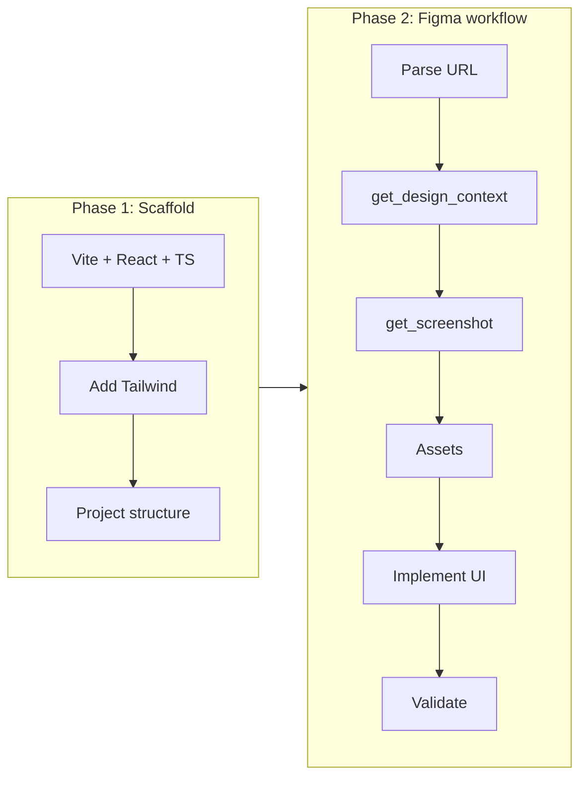

# Implement Figma design for [Libell.us](http://Libell.us)

## Current state

- **Workspace:** Only [.cursor/settings.json](.cursor/settings.json) and an empty `src/` folder exist.
- **Figma source:** [Libell.us-Design](https://www.figma.com/design/6MgTkvdWSR9XpkxBsEJ1NH/Libell.us-Design?node-id=1-41) — node ID `1-41`.
- **Target stack:** Vite + React + TypeScript + Tailwind.

## Implementation approach



---

## File structure

Target layout after scaffold and first Figma implementation:

```
libell.us/
├── .cursor/
├── public/
│   └── vite.svg
├── src/
│   ├── assets/              # Images, SVGs, fonts from Figma or static assets
│   ├── components/          # Reusable UI
│   │   ├── ui/              # Primitives (Button, Card, etc.) — add as design grows
│   │   └── ...              # Figma-implemented frame and its subcomponents live here initially
│   ├── pages/               # Route-level views (optional until routing is needed)
│   ├── App.tsx
│   ├── main.tsx
│   └── index.css            # Tailwind directives + base styles
├── index.html
├── package.json
├── tailwind.config.js
├── tsconfig.json
└── vite.config.ts
```

**Decisions:**

- `**src/components/` — All Figma-derived components go here at first. If the frame is a full page, it can be a single component (e.g. `LandingSection.tsx`) or split by section (e.g. `Hero.tsx`, `Features.tsx`). A `ui/` subfolder is reserved for shared primitives once they emerge.
- `**src/assets/` — Icons, logos, and images returned by the Figma MCP; import from here so the build and Tailwind content paths stay simple.
- `**src/pages/` — Omitted until we add routing; the first implementation is rendered directly from `App.tsx`.
- **No `lib/` or `hooks/`** initially — add when shared logic or hooks appear.

After we fetch the Figma context for node `1-41`, we can name the root component and any children to match the design (e.g. frame name or “LibellLanding”).

---

## Phase 1: Scaffold the project

1. **Create Vite + React + TypeScript app** in the workspace root (e.g. `npm create vite@latest . -- --template react-ts` or equivalent so existing `.cursor` and `src` are preserved or merged).
2. **Add and configure Tailwind CSS** (PostCSS, `tailwind.config.js`, content paths, base styles in `src/index.css`).
3. **Apply the file structure above**: ensure `src/components/` and `src/assets/` exist; implement the Figma frame (and subcomponents) under `src/components/`.

Result: a runnable app (`npm run dev`) with Tailwind available and a clear place for the design implementation.

---

## Phase 2: Implement the Figma design (node 1-41)

Follow the [implement-design](.cursor/plugins/cache/cursor-public/figma/46a7d1bec64e0fd016eea6a66eda8ac34b44c491/skills/implement-design/SKILL.md) workflow. No existing design system yet, so the MCP output (React + Tailwind) will be the main reference, adapted to this project’s file layout and TypeScript.

| Step                        | Action                                                                                                                                                                                                                                |
| --------------------------- | ------------------------------------------------------------------------------------------------------------------------------------------------------------------------------------------------------------------------------------- |
| **1. Parse URL**            | File key: `6MgTkvdWSR9XpkxBsEJ1NH`, node ID: `1-41`.                                                                                                                                                                                  |
| **2. Fetch design context** | Call Figma MCP `get_design_context(fileKey="6MgTkvdWSR9XpkxBsEJ1NH", nodeId="1-41")` to get layout, typography, colors, spacing, and structure. If the response is truncated, use `get_metadata` first, then fetch by child node IDs. |
| **3. Capture screenshot**   | Call `get_screenshot` with the same file key and node ID for visual reference and validation.                                                                                                                                         |
| **4. Assets**               | Use any image/SVG URLs returned by the MCP (e.g. localhost asset endpoint). Do not add new icon libraries; use only what Figma provides. Save under `src/assets/` if needed for the build.                                            |
| **5. Translate to project** | Implement the frame in `src/components/` (one or more components). Use the MCP output as the source of truth; convert to TypeScript, use Tailwind classes, and follow the existing project structure.                                 |
| **6. 1:1 parity**           | Match layout, typography, colors, and spacing to the design; prefer any design tokens from the context over hardcoded values.                                                                                                         |
| **7. Validate**             | Compare the implemented UI to the screenshot (layout, type, colors, assets). Fix discrepancies.                                                                                                                                       |

**Integration:** Render the implemented root component for node `1-41` in `App.tsx` so the design is visible when running the app.

---

## Deliverables

- Runnable Vite + React + TypeScript + Tailwind app in the repo root.
- Implementation of the Figma frame at node `1-41` in `src/components/`, with assets under `src/assets/` if any.
- `App.tsx` updated to show the implemented design.
- Visual validation against the Figma screenshot.

## Notes

- **Figma MCP:** Ensure the Figma MCP server is connected and authenticated so `get_design_context` and `get_screenshot` work.
- **Rate limits:** Figma MCP has rate limits; a single implementation flow (context + screenshot + optional metadata) should stay within limits.
- **Cursor rules:** If the plugin added Figma-specific rules (e.g. asset handling), they will be followed during implementation.
